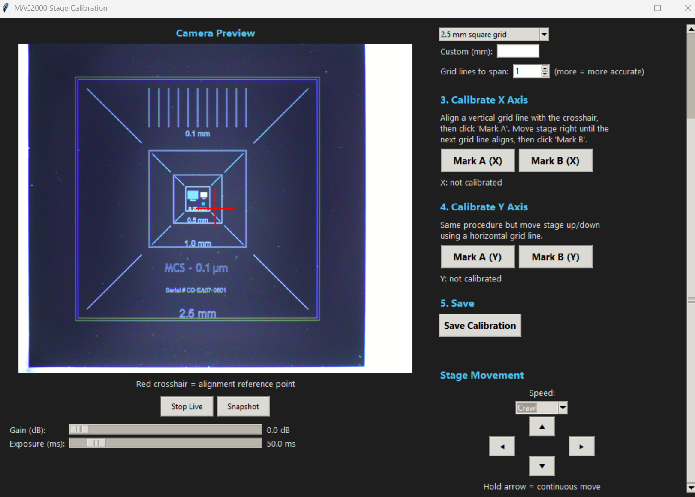

# MAC2000 Stage Calibration Guide

## Overview

This guide walks through calibrating the Ludl LEP MAC2000 motorized stage using the MCS-0.1um calibration standard and the `calibrate_stage.py` GUI tool. Calibration determines the precise relationship between motor steps and physical distance (micrometers) for both X and Y axes.

**Equipment Required:**
- Ludl LEP MAC2000 motorized stage (connected via RS-232, typically COM3)
- Teli BU505MC camera (USB3, 2448x2048 resolution)
- WILD stereo microscope
- MCS-0.1um calibration standard (Serial # CD-EA07-0801)

**Calibration Standard Grid Sizes:**

| Grid Level | Spacing |
|------------|---------|
| Outermost  | 2.5 mm  |
| Second     | 1.0 mm  |
| Third      | 0.5 mm  |
| Fourth     | 0.25 mm |
| Innermost  | 0.1 mm  |

---

## Step 1: Place the Calibration Standard

1. Place the MCS-0.1um calibration standard on the stage
2. Use a low magnification objective (6.3x or 10x) to locate the grid pattern
3. The grid has nested squares with labeled dimensions — you should see the full pattern similar to the image below

> **Reference:** The calibration standard showing nested grid squares from 2.5 mm down to 0.1 mm.
> See: `cal_standard_photo.png` in the MAC2000 folder
>
> 

---

## Step 2: Launch the Calibration Tool

Open a terminal and run:

```bash
python MAC2000/calibrate_stage.py
```

The GUI will open with:
- **Left side:** Live camera preview with a red crosshair at center
- **Right side:** Calibration controls organized in numbered steps

> **Reference:** The calibration GUI after connecting to stage and camera.
> See: `Screenshots/Screenshot 2026-02-20 095559.png`

---

## Step 3: Connect to Hardware

1. Enter the COM port (default: **COM3**) in the "COM Port" field
2. Click **Connect**
3. The status bar should show: `Stage: COM3 OK | Camera: BU505MC`
4. The live camera feed should appear in the preview panel
5. The **Position** display will show the current stage coordinates (e.g., `Position: -7757 , -73326`)

> **Tip:** If you get "Access is denied" on the COM port, make sure no other program (TeliViewer, another instance of the GUI, etc.) is using the serial port.

---

## Step 4: Select Grid Spacing

1. In section **2. Grid Spacing**, select the grid size from the dropdown:
   - **2.5 mm square grid** (recommended for initial calibration)
   - 1.0 mm, 0.5 mm, 0.25 mm, or 0.1 mm for finer calibration
   - Custom value for non-standard grids

2. Set **Grid lines to span**: default is 1 (one grid square). Using more lines increases accuracy.

> **Recommendation:** Use the **2.5 mm** grid for best results. The larger the distance, the more motor steps are measured, which reduces the relative error of any single-step inaccuracy. Our calibration used 2.5 mm and achieved ~2.5 steps/um on both axes.

---

## Step 5: Calibrate X Axis

This measures how many motor steps correspond to one micrometer of horizontal travel.

1. **Navigate to a vertical grid line** using the stage movement arrow buttons
   - Use **Slow** speed for coarse positioning, switch to **Nudge** or **1-Step** for fine alignment
   - The goal is to align a vertical grid line precisely with the **red crosshair**

2. Click **Mark A (X)** to record the first position
   - The status will show the recorded step count (e.g., `A: -4621`)

3. **Move the stage horizontally** (right) until the **next vertical grid line** aligns with the crosshair
   - If you selected 2.5 mm grid, move to the next 2.5 mm line
   - If "Grid lines to span" is set to 2, move across 2 grid lines (5.0 mm total)

4. Click **Mark B (X)** to record the second position
   - The software calculates: `steps_per_um = |step_B - step_A| / (grid_spacing_mm * 1000)`
   - Result displays below (e.g., `X: 2.5012 steps/um`)

> **Important:** Align the grid line precisely with the crosshair center. The accuracy of your calibration depends entirely on how precisely you align these two points.

---

## Step 6: Calibrate Y Axis

Same procedure but for vertical travel.

1. **Navigate to a horizontal grid line** and align it with the red crosshair
2. Click **Mark A (Y)**
3. **Move the stage vertically** (up or down) to the next horizontal grid line
4. Click **Mark B (Y)**
5. Result displays (e.g., `Y: 2.5000 steps/um`)

---

## Step 7: Save Calibration

1. Click **Save Calibration**
2. Results are saved to `MAC2000/stage_calibration.json`
3. This file is automatically loaded by the tile scan tool (`scan_gui.py`)

**Example calibration results:**

```json
{
  "grid_spacing_mm": 2.5,
  "grid_lines_spanned": 1,
  "x_axis": {
    "point_a_steps": -4621,
    "point_b_steps": -10874,
    "step_difference": 6253,
    "distance_um": 2500.0,
    "steps_per_um": 2.5012,
    "um_per_step": 0.3998
  },
  "y_axis": {
    "point_a_steps": -76464,
    "point_b_steps": -70214,
    "step_difference": 6250,
    "distance_um": 2500.0,
    "steps_per_um": 2.5,
    "um_per_step": 0.4
  }
}
```

**What this means:**
- 1 motor step = ~0.4 um of physical travel (both axes)
- 2.5 steps = 1 um
- Lead screw pitch is 2 mm, motor is 200 steps/rev with 25x microstepping
- Proof: 2000 um / (200 x 25) = 2000 / 5000 = 0.4 um/step

---

## Verification

After calibrating, you can verify accuracy using the Die Analysis Tool (STEEL):

1. Capture an image of the calibration standard
2. Open in the Die Analysis Tool
3. Use the measurement tool to measure a known grid distance
4. Compare the measured value to the labeled value

> **Reference:** Verification measurement in STEEL showing 2.4831 mm across the 2.5 mm grid.
> See: `Screenshots/Screenshot 2026-02-20 212610.png`

---

## GUI Controls Reference

### Camera Controls
| Control | Range | Default |
|---------|-------|---------|
| Gain    | 0-24 dB | 0 dB |
| Exposure | 1-500 ms | 50 ms |
| Zoom    | 1x, 2x, 4x, 8x | 1x |

### Stage Movement
| Speed Preset | Pulses/sec | Best For |
|-------------|-----------|----------|
| 1-Step      | 85        | Fine alignment (single steps) |
| Nudge       | 150       | Precise positioning |
| Crawl       | 500       | Slow navigation |
| Slow        | 5,000     | Moving between grid lines |

### Buttons
- **Stop Live / Start Live** — Toggle camera feed
- **Snapshot** — Capture and save current frame
- **Arrow buttons** — Hold for continuous jog movement in that direction

---

## Troubleshooting

| Issue | Cause | Fix |
|-------|-------|-----|
| "Failed to open COM3" | Port in use | Close other programs using COM3 (TeliViewer, other GUI instances) |
| Camera feed is black | Camera not connected | Check USB3 cable, reconnect camera |
| Gain/Exposure sliders don't respond | GenICam XML not installed | Known issue — sliders will work after pytelicam SDK upgrade |
| Position shows `-- , --` | Stage not responding | Check RS-232 cable, power cycle MAC2000 controller |
| Grid lines not visible | Wrong magnification | Use lower magnification (6.3x or 10x) to see full grid pattern |

---

## Files

| File | Purpose |
|------|---------|
| `calibrate_stage.py` | Calibration GUI tool |
| `stage_calibration.json` | Saved calibration data (auto-loaded by scan tool) |
| `cal_standard_photo.png` | Reference photo of calibration standard in the GUI |
| `mac2000_driver.py` | Stage communication driver |
| `teli_camera.py` | Camera driver |

---

*Last updated: February 2026*
